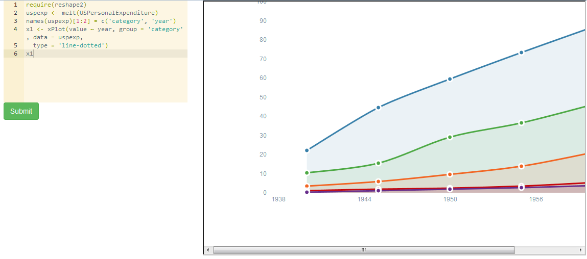

## Running 'R' statistical code from within AngularJS

This App allows you to run [R](http://www.r-project.org/) code from within this Angular App and visualise the output as a plot on the screen.

### App Specifics

This App is taken from the code for [Interactive Playground for R Packages: Part 1](http://ramnathv.github.io/posts/making-rcharts-live-app/index.html) by [Ramnath Vaidyanathan](https://github.com/ramnathv).

### The App uses the following:

- [OpenCPU](https://www.opencpu.org/jslib.html) to call [R](http://www.r-project.org/) 
- [ACE Editor](https://github.com/ajaxorg/ace)

### Running the App

- clone the repository
- select _index.html_

You can edit the input area text and submit any changes made.
You can also copy and paste the code samples from the [rCharts Repo](https://github.com/ramnathv/rCharts) into the input area and hit the _Submit_ button. In the output area you should now be presented with a graph of the output. [Here is a tutorial on how rCharts works](http://rcharts.io/howitworks/). 

### Screen Shot

	

Michael Cullen 2014

